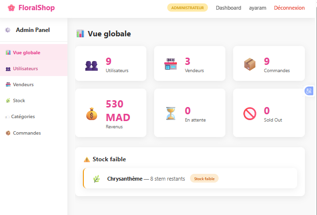
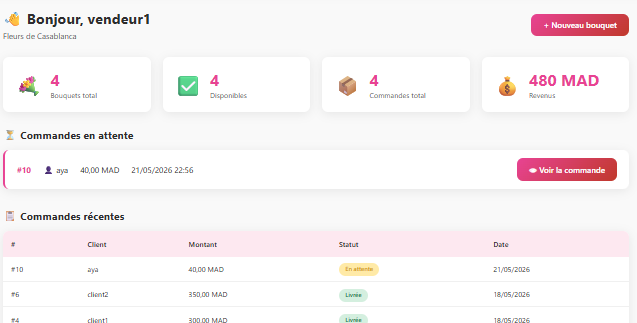
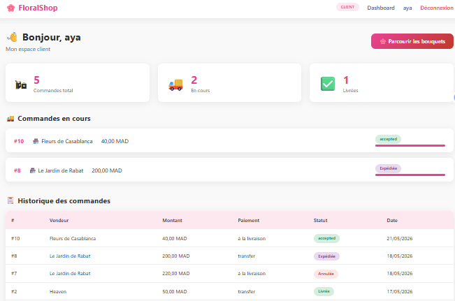
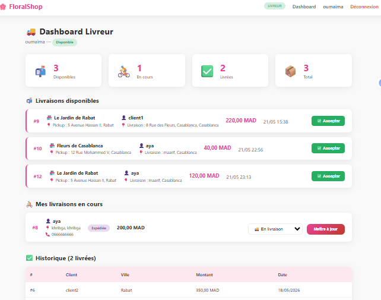

# Flower-market
Plateforme e-commerce de vente et livraison de fleurs 
# Fonctionnalités

- Catalogue de produits avec catégories et filtres
-Panier et gestion des commandes
- Suivi de commandes et gestion des livraisons
-Authentification et gestion des utilisateurs
-Interface d'administration pour la gestion des produits et commandes

# Aperçu







# Technologies utilisées
Python 3.x | Langage principal 
Django | Framework web 
dbqlite | Base de données 
HTML / CSS | Templates frontend 
Django ORM | Gestion base de données PlantUML / StarUML | Modélisation UML 


# Installation & Lancement

### Prérequis
- Python 3.x installé

### Étapes

```bash
# 1. Cloner le projet
git clone https://github.com/AyaRamich/Flower-market.git
cd Flower-market

# 2. Créer un environnement virtuel
python -m venv venv
venv\Scripts\activate        # Windows
# source venv/bin/activate   # Mac/Linux

# 3. Installer les dépendances
pip install -r requirements.txt

# 4. Appliquer les migrations
python manage.py migrate

# 5. Lancer le serveur
python manage.py runserver
```

Ouvre **http://127.0.0.1:8000** dans ton navigateur 

# Auteure

**Aya Ramich** — Étudiante Ingénieure en Informatique & Réseaux, EMSI Casablanca

[](https://linkedin.com/in/aya-ramich)
[](https://github.com/AyaRamich)
